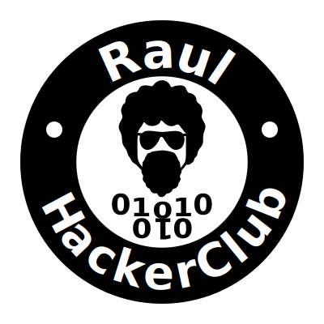
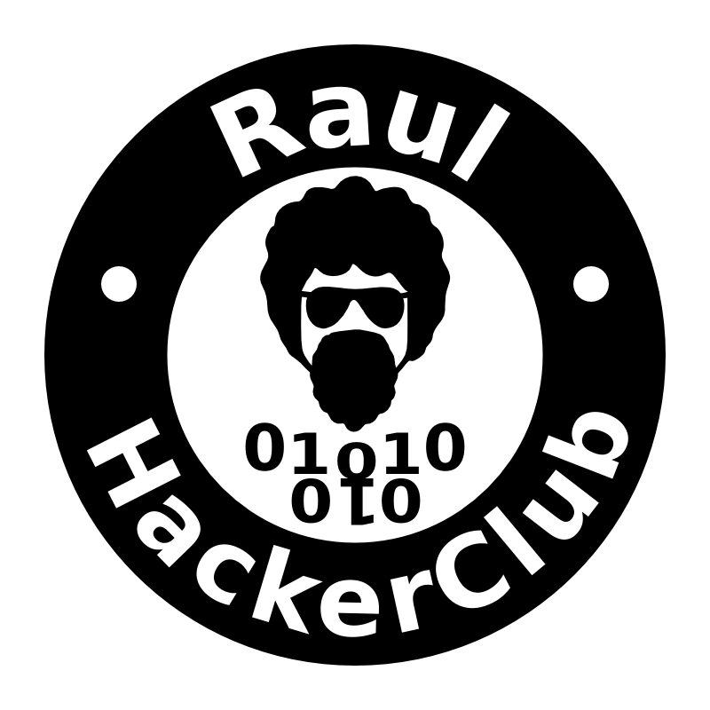
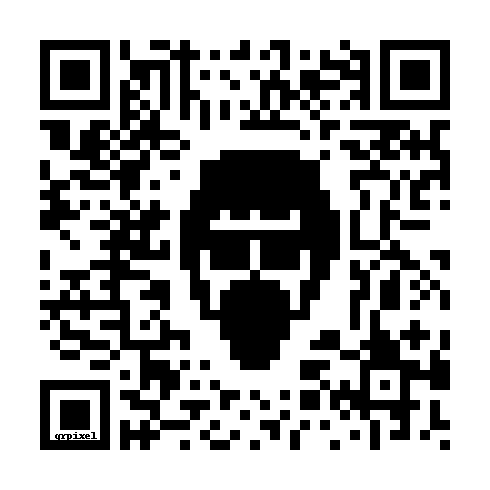

# Logotipo

Repositório para armazenar projetos relacionada à logo (ou outras imagens) do Raul Hacker Club, ex: favico.

## SVG

Fontes usadas:

* Dingbats — para o binário
* DejaVu Sans — para as palavras 

> **Autor original:**
>
> [Arthur Araújo, 05 de Abril 2013](http://tutzstyle.com/portfolio/raul-hacker-club/)
>
> **Licença:**
>
> [Creative Commons (CC BY-SA 3.0)](https://creativecommons.org/licenses/by-sa/3.0/deed.pt) (mesma do site do autor, onde foi publicado pela primeira vez) 

## PNG

## Pixel Art

#### Fake

## Ascii Art

[Ascii Art da logo do Raul Hacker Club](asciiart.txt)

## QR Code

> Esse QR Code direciona para [raulhc.cc](http://raulhc.cc)

## PDF

[PDF da logo do Raul Hacker Club](RaulHackerClub-5x5cm.pdf)

> Utilizado para corte

## Favico

